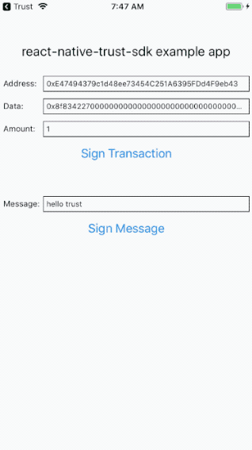

# react-native-trust-sdk

[](https://travis-ci.org/TrustWallet/react-native-trust-sdk)
[](https://badge.fury.io/js/react-native-trust-sdk)
[](https://coveralls.io/github/TrustWallet/react-native-trust-sdk?branch=master)

The react-native-trust-sdk lets you sign Ethereum transactions and messages with Trust Wallet so that you can bulid a react native DApp without having to worry about keys or wallets.

* [Installation](#installation)
* [Configuring Android](#configuring-android)
* [Configuring iOS](#configuring-ios)
* [Example](#example)
* [Usage](#usage)
* [Contributing](#contributing)
* [License](#license)

## Installation

```shell
npm i react-native-trust-sdk
```

## Configuring Android

Make sure you have set up intent-filter for your app ([documentation here](https://developer.android.com/training/app-links/deep-linking#adding-filters))

example app settings:

```xml
<activity
  android:name=".MainActivity"
  android:launchMode="singleTask"
    <intent-filter>
        <action android:name="android.intent.action.VIEW" />
        <category android:name="android.intent.category.DEFAULT" />
        <data android:scheme="trust-rn-example"/>
    </intent-filter>
</activity>
```

## Configuring iOS

Make sure you have set up url scheme for your app (Open Xcode an click on your project. Go to the 'Info' tab and expand the 'URL Types' group).

example app settings:

```xml
<key>CFBundleURLTypes</key>
<array>
  <dict>
    <key>CFBundleTypeRole</key>
    <string>Editor</string>
    <key>CFBundleURLSchemes</key>
    <array>
      <string>trust-rn-example</string>
    </array>
  </dict>
</array>
```

```objc
// iOS 9.x or newer
#import <React/RCTLinkingManager.h>

- (BOOL)application:(UIApplication *)application
   openURL:(NSURL *)url
   options:(NSDictionary<UIApplicationOpenURLOptionsKey,id> *)options
{
  return [RCTLinkingManager application:application openURL:url options:options];
}

// If your app is using Universal Links
- (BOOL)application:(UIApplication *)application continueUserActivity:(NSUserActivity *)userActivity
 restorationHandler:(void (^)(NSArray * _Nullable))restorationHandler
{
 return [RCTLinkingManager application:application
                  continueUserActivity:userActivity
                    restorationHandler:restorationHandler];
}
```

## Example

Checkout the example typescript project in `example` folder.

```shell
npm install && npm start
react-native run-ios
```



## Usage

import the package:

```typescript
import TrustWallet, { MessagePayload, TransactionPayload } from 'react-native-trust-sdk';
```

initialize an instance, e.g. in `componentDidMount`:

```typescript
const wallet = new TrustWallet('<your_app_scheme>://');
```

sign a message:

```typescript
const payload = new MessagePayload('hello trust');
wallet.signMessage(payload)
    .then((result) => {
      console.log('Message Signed', result);
    }).catch((error) => {
      console.log('Error', error);
    });
```

sign a transaction:

```typescript
const payload = new TransactionPayload('<address>', '<amount>', '<data>');
wallet.signTransaction(payload)
    .then((result) => {
      console.log('Transaction Signed', result);
    })
    .catch((error) => {
      console.log('Error', error);
    });
});
```

clean up all resolve handlers, e.g. in`componentWillUnmount`:

```typescript
wallet.cleanup();
```

## Contributing

You are welcome! Create pull requests and help to improve the package.

## License

GPLv3
